# **The script of queries**

Think Like a Frontend API Imagine the following queries are API endpoints the 
frontend will call: 

**1. GET /loans/overdue**

List all overdue loans with member name, book title, due date  

```sql
SELECT * FROM Member_books;
SELECT * FROM Loan;
SELECT * FROM Member;

SELECT M.Full_Name as 'Member Name', B.Title as 'Book Title', L.Due_Date as 'Due Date'
FROM Loan L INNER JOIN Member_books MB ON L.LoanID = MB.LoanID
INNER JOIN Book B ON B.BookID = MB.BookID
INNER JOIN Member M ON M.MemberID = MB.MemberID
WHERE MB.Status = 'Overdue';
```

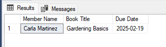

**2. GET /books/unavailable**

 List books not available

 ```sql
 SELECT * FROM Book;

SELECT * FROM Book WHERE Availability_Status = 'FALSE';
 ```

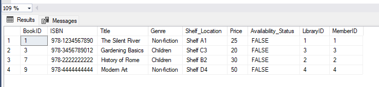

**3. GET /members/top-borrowers**

Members who borrowed >2 books 

```sql
SELECT * FROM Member_books;
SELECT * FROM Member;

SELECT M.Full_Name as 'Member Name', COUNT(MB.MemberID) AS Total_Borrowed
FROM Member M INNER JOIN Member_books MB ON M.MemberID = MB.MemberID
GROUP BY M.MemberID, M.Full_Name
HAVING COUNT(MB.MemberID) > 2;
```

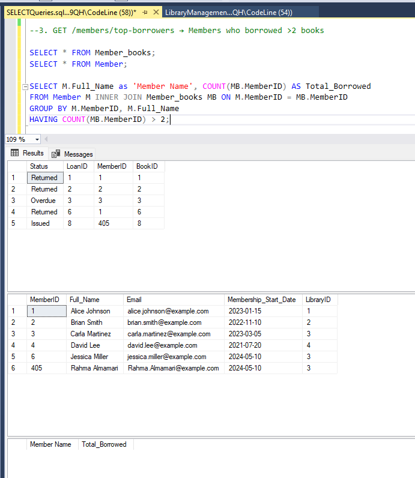

**4. GET /books/:id/ratings**

Show average rating per book

```sql
SELECT * FROM Book;
SELECT * FROM Review;
SELECT * FROM Member_reviewed_books;

SELECT B.BookID as 'Book ID', B.Title as 'Book Title', AVG(R.Rating) as 'Average Rating'
FROM Book B INNER JOIN Member_reviewed_books MRB ON B.BookID = MRB.MemberID
INNER JOIN Review R ON R.ReviewID = MRB.ReviewID
GROUP BY B.BookID,  B.Title;
```

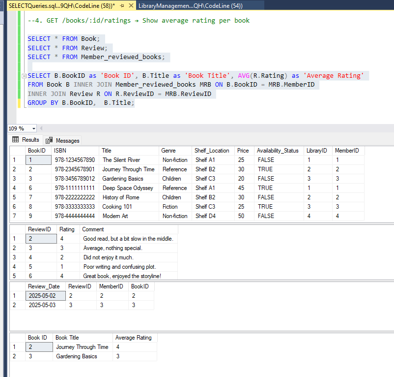

**5. GET /libraries/:id/genres**

 Count books by genre 

 ```sql
 SELECT * FROM Book;
SELECT * FROM Library;

SELECT L.LibraryID as 'Library ID', L.LibraryName as 'Library Name', B.Genre as 'Genre', COUNT(B.LibraryID) as 'Number of Books'
FROM Library L INNER JOIN Book B ON L.LibraryID = B.LibraryID
GROUP BY L.LibraryID, L.LibraryName, B.Genre;
 ```

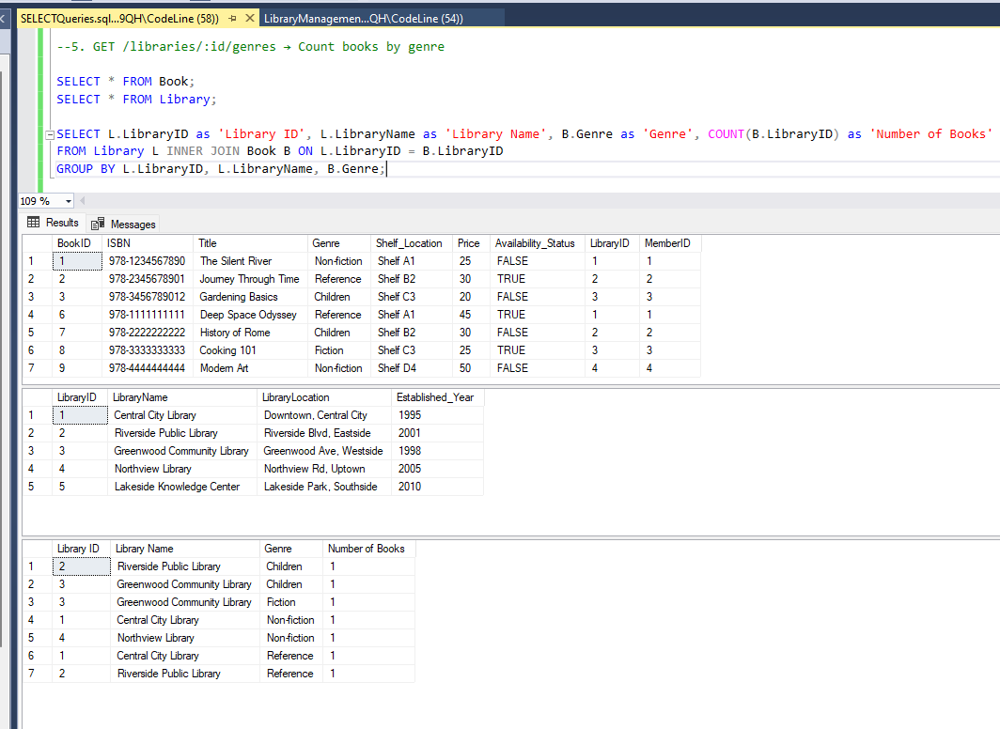

**6. GET /members/inactive**

 List members with no loans  

 ```sql
SELECT * FROM Member_books;
SELECT * FROM Member;

SELECT M.Full_Name as 'Member Name'
FROM Member M LEFT JOIN Member_books MB ON M.MemberID = MB.MemberID
WHERE MB.MemberID IS NULL;
 ```

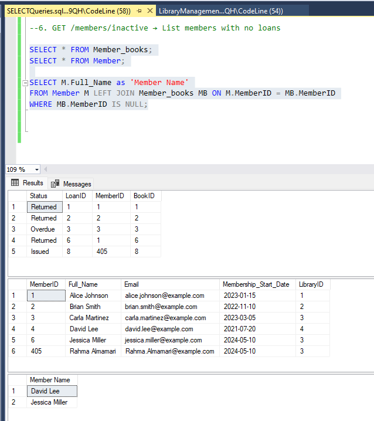

**7. GET /payments/summary**

Total fine paid per member  

```sql
SELECT * FROM Member_books;
SELECT * FROM Member;
SELECT * FROM Loan;
SELECT * FROM Payment;

SELECT M.MemberID as 'Member ID', M.Full_Name as 'Member Name', SUM(P.Amount) as 'Total Fine' 
FROM Member M INNER JOIN Member_books MB ON M.MemberID = MB.MemberID
INNER JOIN Loan L ON L.LoanID = MB.LoanID
INNER JOIN Payment P ON L.LoanID = P.LoanID
GROUP BY M.MemberID, M.Full_Name;
```

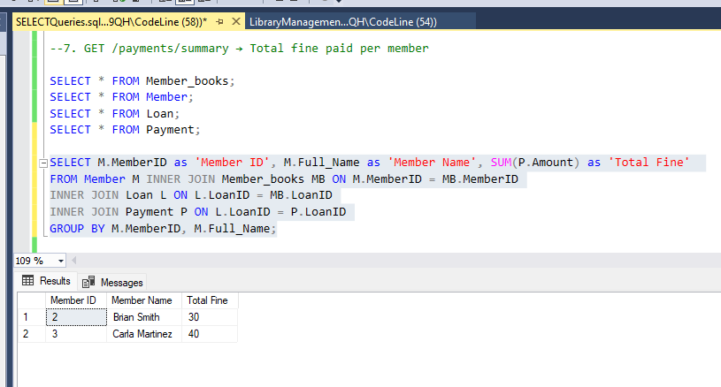

**8. GET /reviews**

Reviews with member and book info

```sql
SELECT * FROM Member;
SELECT * FROM Book;
SELECT * FROM Review;
SELECT * FROM Member_reviewed_books;

SELECT
M.MemberID as 'Member ID', M.Full_Name as 'Member Name', 
B.BookID as 'Book ID', B.Title as 'Book Title', B.Genre as 'Book Genre', B.Price as 'Book Price',
R.ReviewID as 'Review ID', R.Rating as 'Review Rating', R.Comment as 'Review Comment'
FROM Member M INNER JOIN Member_reviewed_books MRB ON M.MemberID = MRB.MemberID
INNER JOIN Book B ON B.BookID = MRB.BookID 
INNER JOIN Review R ON R.ReviewID = MRB.ReviewID;
```

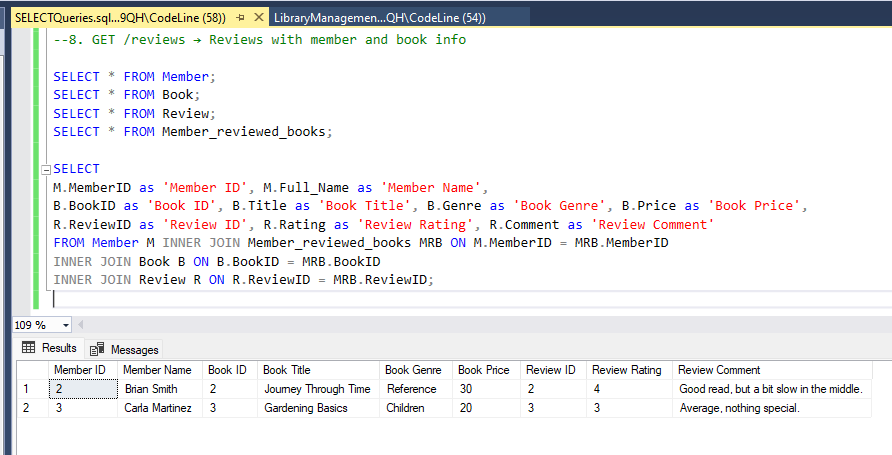

**9. GET /books/popular**

 List top 3 books by number of times they were loaned 

 ```sql
 SELECT * FROM Book;
SELECT * FROM Member_books;

SELECT B.BookID as 'Book ID', B.Title as 'Book Title', COUNT(MB.BookID) as 'Number of Times Loaned'
FROM Book B INNER JOIN Member_books MB ON B.BookID = MB.BookID
GROUP BY B.BookID, B.Title
ORDER BY COUNT(MB.BookID);
 ```

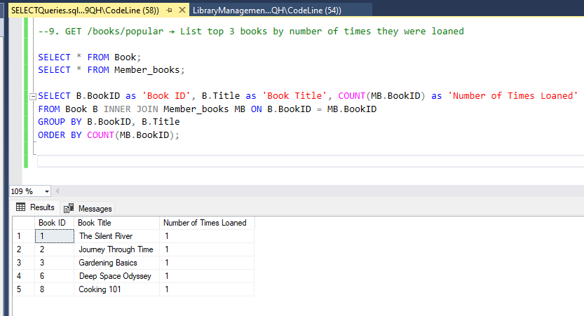

**10. GET /members/:id/history**

Retrieve full loan history of a specific member including book title, 
loan & return dates.

```sql
SELECT * FROM Loan;
SELECT * FROM Member_books;
SELECT * FROM Book;
SELECT * FROM Member;


SELECT B.Title as 'Book Title', L.LoanID as 'Loan ID', L.Return_Date as 'Return Date'
FROM Member M FULL OUTER JOIN Member_books MB ON M.MemberID = MB.MemberID
FULL OUTER JOIN Book B ON B.BookID = MB.BookID
FULL OUTER JOIN Loan L ON L.LoanID = MB.LoanID
WHERE M.MemberID = '1';
```

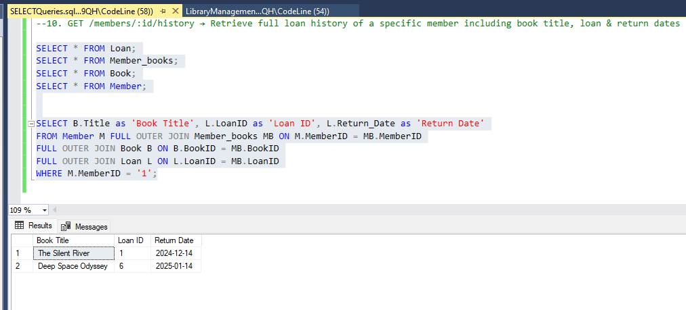

**11. GET /books/:id/reviews**

Show all reviews for a book with member name and comments.

```sql
SELECT * FROM Book;
SELECT * FROM Member;
SELECT * FROM Review;
SELECT * FROM Member_reviewed_books;

SELECT B.BookID as 'Book ID', B.Title as 'Book Title', M.Full_Name as 'Member Name', R.Comment as 'Comment'
FROM Book B FULL OUTER JOIN Member_reviewed_books MRB ON B.BookID = MRB.BookID
INNER JOIN Member M ON M.MemberID = MRB.MemberID
INNER JOIN Review R ON R.ReviewID = MRB.ReviewID
```

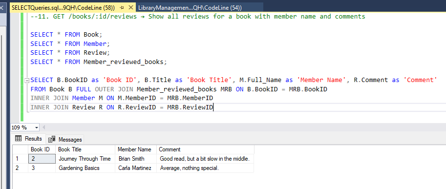

**12. GET /libraries/:id/staff**

List all staff working in a given library.

```sql
SELECT * FROM Staff;
SELECT * FROM Library;

SELECT S.Staff_ID as 'Staff ID', S.Full_Name as 'Staff Name', S.Position as 'Staff Position'
FROM Library L INNER JOIN Staff S ON L.LibraryID = S.LibraryID
WHERE L.LibraryID = '1';
```

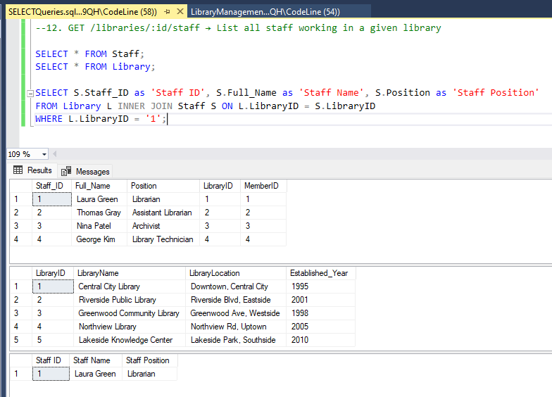

**13. GET /books/price-range?min=5&max=15**

Show books whose prices fall within a given range.

```sql
SELECT * FROM Book;

SELECT * FROM Book WHERE Price >= 5 AND Price <= 15;
```

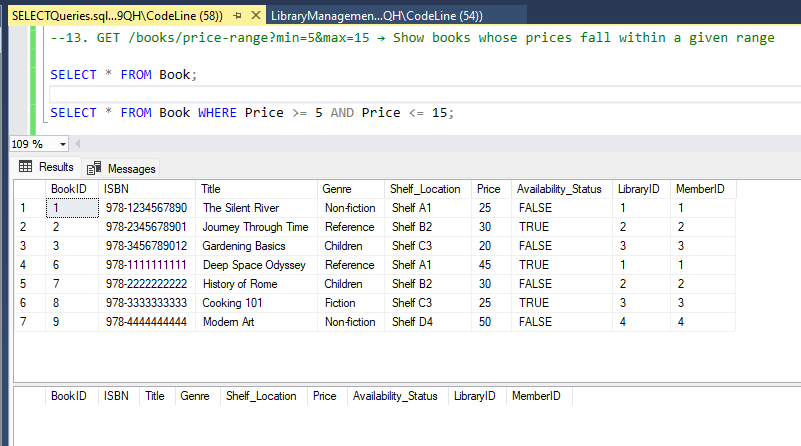

**14. GET /loans/active**

List all currently active loans (not yet returned) with member and book info.

```sql
SELECT * FROM Book;
SELECT * FROM Member;
SELECT * FROM Loan;
SELECT * FROM Member_books;

SELECT L.LoanID as 'Loan ID',
M.MemberID  as 'Member ID', M.Full_Name as 'Member Name', 
B.BookID as 'Book ID', B.Title as 'Book Title', B.Genre as 'Book Genre', B.Price as 'Book Price', 
MB.Status as 'Loan Status'
FROM Loan L INNER JOIN Member_books MB ON L.LoanID = MB.LoanID
INNER JOIN Member M ON M.MemberID = MB.MemberID
INNER JOIN Book B ON B.BookID = MB.BookID
WHERE MB.Status != 'Returned';
```

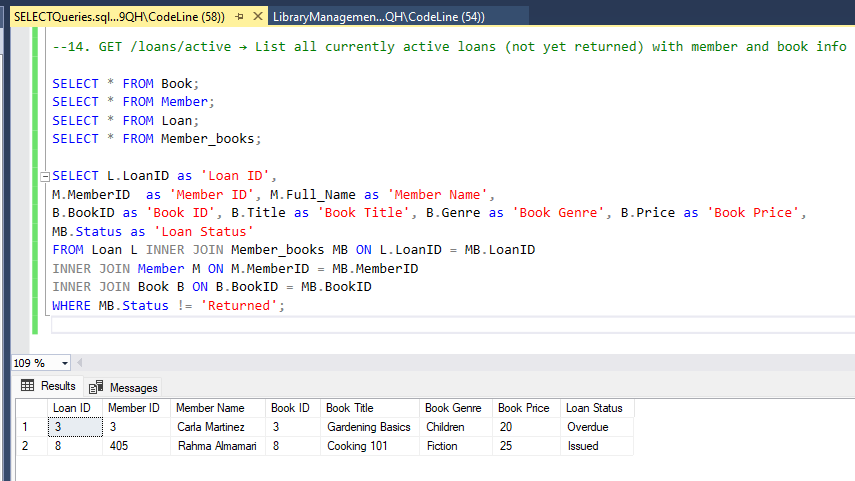

**15. GET /members/with-fines**

List members who have paid any fine.

```sql
SELECT * FROM Member;
SELECT * FROM Loan;
SELECT * FROM Member_books;
SELECT * FROM Payment;

SELECT M.MemberID as 'Member ID', M.Full_Name as 'Member Name',
L.LoanID as 'Loan ID',
P.*
FROM Member M INNER JOIN Member_books MB ON M.MemberID = MB.MemberID
INNER JOIN Loan L ON L.LoanID = MB.LoanID
RIGHT OUTER JOIN Payment P ON L.LoanID = P.LoanID;
```

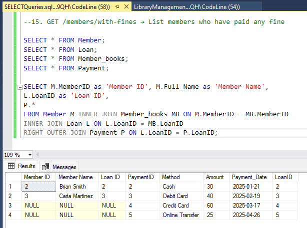

**16. GET /books/never-reviewed**

List books that have never been reviewed.

```sql
SELECT * FROM Book;
SELECT * FROM Member_reviewed_books;

SELECT B.*
FROM Book B LEFT OUTER JOIN Member_reviewed_books MRB ON B.BookID = MRB.BookID
WHERE MRB.BookID  IS NULL;
```

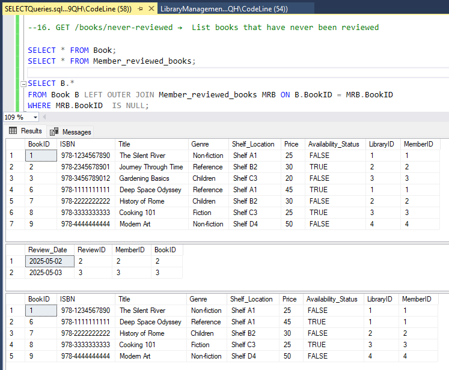

**17. GET /members/:id/loan-history**

Show a member’s loan history with book titles and loan status. 

```sql
SELECT * FROM Book;
SELECT * FROM Member;
SELECT * FROM Loan;
SELECT * FROM Member_books;

SELECT L.*, B.Title as 'Book Title', MB.Status as 'Loan Status'
FROM Loan L LEFT OUTER JOIN Member_books MB ON L.LoanID = MB.LoanID
INNER JOIN Member M ON M.MemberID = MB.MemberID 
INNER JOIN Book B ON B.BookID = MB.BookID;
```

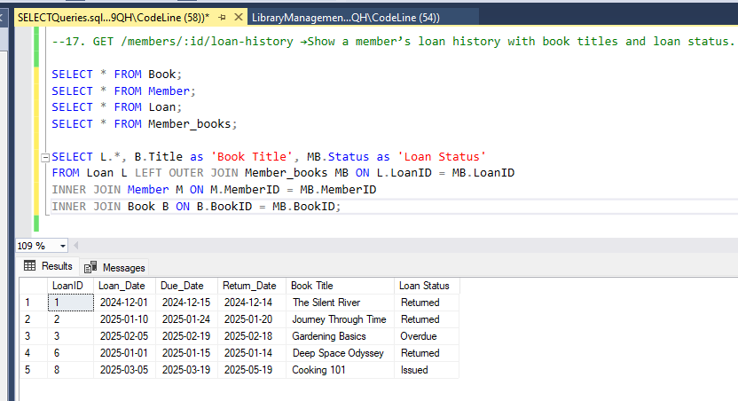


